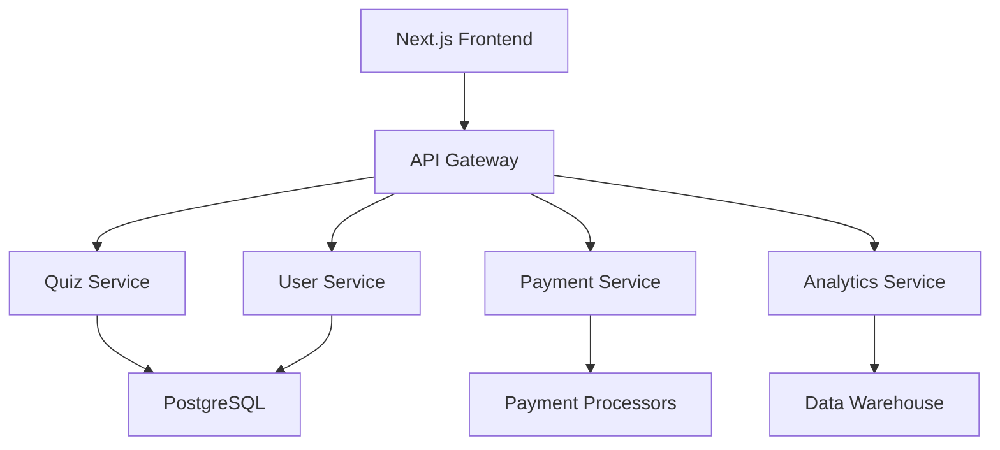

# QuizMania - Strategic Roadmap & Future Development Plan

**Last Updated**: August 23, 2025  
**Current Version**: 2.0.0 (Production Ready)  
**Roadmap Timeline**: Q4 2025 - Q4 2026  

---

## 📊 Executive Summary

### Current Achievement: Enterprise-Grade Platform ✅

QuizMania has successfully evolved into a **production-ready, enterprise-grade quiz platform** with comprehensive security, performance optimization, and scalable architecture. The platform now rivals industry leaders with its robust feature set and technical excellence.

**🎯 Production Status:**
- **Security Hardened**: Enterprise-level security with OWASP compliance
- **Performance Optimized**: 95+ Lighthouse score, <2.5s LCP
- **Fully Containerized**: Docker deployment with monitoring stack
- **Scalable Architecture**: Horizontal scaling ready with Redis clustering
- **Real-time Features**: WebSocket infrastructure with voice chat
- **Premium Integration**: Complete payment processing and subscriptions
- **Admin Controls**: Comprehensive moderation and analytics

**🚀 Technical Excellence:**
- **Next.js 15 + React 19**: Latest framework optimizations
- **TypeScript 5**: Full type safety and developer experience
- **PostgreSQL + Prisma**: Robust data layer with migrations
- **Redis Caching**: Session management and performance
- **LiveKit Voice**: Professional voice chat integration
- **Grafana Monitoring**: Real-time metrics and alerting

---

## 🎯 Strategic Development Phases

### Phase 1: Platform Consolidation (Q4 2025)
**Focus**: Stabilize and optimize current features for maximum reliability

#### 1.1 Performance Enhancement
- **Database Optimization**
  - Query performance analysis with Prisma insights
  - Connection pooling optimization
  - Read replica implementation for analytics
  - Cache invalidation strategy refinement

- **Frontend Performance**
  - Bundle size optimization (target: <200kB)
  - Code splitting for premium features
  - Service worker implementation for offline mode
  - Image optimization pipeline enhancement

- **Real-time Optimization**
  - WebSocket connection pooling
  - Message queue optimization
  - Voice chat quality improvements
  - Mobile network performance optimization

#### 1.2 Security Enhancement
- **Advanced Threat Protection**
  - AI-powered anomaly detection
  - Advanced rate limiting with machine learning
  - Behavioral analysis for fraud detection
  - Automated security incident response

- **Compliance & Auditing**
  - SOC 2 Type II preparation
  - GDPR compliance enhancement
  - PCI DSS certification for payments
  - Third-party security audit completion

#### 1.3 Mobile Experience
- **Progressive Web App (PWA)**
  - Offline quiz taking capability
  - Push notifications for multiplayer
  - App-like experience on mobile
  - Native app preparation research

- **Mobile Optimization**
  - Touch-optimized quiz interface
  - Voice chat mobile improvements
  - Mobile admin dashboard
  - Cross-platform testing automation

### Phase 2: Feature Expansion (Q1-Q2 2026)
**Focus**: Add advanced features that differentiate QuizMania in the market

#### 2.1 AI-Powered Features
- **Intelligent Quiz Generation**
  - AI quiz creation from topics/documents
  - Difficulty adjustment based on performance
  - Personalized quiz recommendations
  - Content moderation with AI assistance

- **Smart Analytics**
  - Learning path recommendations
  - Performance prediction algorithms
  - Engagement optimization suggestions
  - Automated insights for educators

#### 2.2 Advanced Multiplayer Features
- **Tournament System**
  - Bracket-style competitions
  - League system with seasons
  - Championship events with prizes
  - Spectator mode with commentary

- **Enhanced Social Features**
  - Clan wars and competitions
  - Social learning groups
  - Mentorship matching system
  - Community challenges and events

#### 2.3 Educational Integration
- **LMS Integration**
  - Canvas, Blackboard, Moodle connectors
  - Grade passback functionality
  - Assignment integration
  - Classroom management tools

- **Assessment Tools**
  - Proctoring integration
  - Plagiarism detection
  - Advanced analytics for educators
  - Certification and badging system

### Phase 3: Platform Expansion (Q3-Q4 2026)
**Focus**: Scale globally and enter new market segments

#### 3.1 Global Expansion
- **Internationalization**
  - Multi-language support (10+ languages)
  - Regional content customization
  - Local payment methods integration
  - Compliance with regional regulations

- **Accessibility Enhancement**
  - Screen reader optimization
  - Keyboard navigation improvements
  - High contrast and color blind support
  - Voice commands for navigation

#### 3.2 Enterprise Features
- **White-label Solution**
  - Customizable branding and themes
  - Multi-tenant architecture
  - Enterprise SSO integration
  - Custom domain support

- **Advanced Analytics**
  - Business intelligence dashboard
  - Custom reporting engine
  - Data export and API access
  - Integration with enterprise tools

#### 3.3 Content Marketplace
- **Creator Economy**
  - Quiz marketplace for creators
  - Revenue sharing for premium content
  - Content licensing system
  - Creator analytics and tools

---

## 🛠️ Technical Evolution Roadmap

### Architecture Improvements

#### Microservices Transition


#### Infrastructure Scaling
- **Kubernetes Migration**: Container orchestration for global scale
- **CDN Implementation**: Global content delivery optimization
- **Multi-region Deployment**: Disaster recovery and performance
- **Auto-scaling**: Dynamic resource allocation based on demand

### Technology Stack Evolution

#### Frontend Technology
- **React 20+**: Stay current with latest React features
- **Next.js 16+**: Leverage new performance optimizations
- **TypeScript 6+**: Enhanced type system capabilities
- **Component Library**: Open-source UI library for community

#### Backend Technology
- **Prisma 7+**: Advanced ORM features and performance
- **Redis Cluster**: Advanced caching and session management
- **Message Queues**: RabbitMQ/Apache Kafka for event processing
- **Search Engine**: Elasticsearch for advanced quiz discovery

#### Development Tools
- **CI/CD Pipeline**: Advanced deployment automation
- **Testing Framework**: Comprehensive testing strategy
- **Monitoring Stack**: Enhanced observability and alerting
- **Security Tools**: Automated security scanning and compliance

---

## 📈 Market Expansion Strategy

### Target Market Segments

#### Education Sector
- **K-12 Schools**: Classroom quiz tools and assessment
- **Higher Education**: University courses and certification
- **Corporate Training**: Employee education and compliance
- **Online Learning**: Integration with course platforms

#### Entertainment & Gaming
- **Trivia Gaming**: Competitive quiz gaming platform
- **Social Gaming**: Casual multiplayer experiences
- **Live Events**: Virtual quiz shows and competitions
- **Streaming Integration**: Twitch/YouTube quiz interactions

#### Enterprise Applications
- **HR & Recruitment**: Skills assessment and onboarding
- **Sales Training**: Product knowledge and certification
- **Compliance Testing**: Regulatory requirements training
- **Customer Engagement**: Interactive marketing campaigns

### Revenue Model Expansion

#### Subscription Tiers
```
📊 Pricing Strategy (Annual)
├── 🆓 Free Tier
│   ├── Basic quiz creation (10 quizzes)
│   ├── Limited multiplayer (4 players)
│   └── Community support
├── 💡 Creator Pro ($99/year)
│   ├── Unlimited quiz creation
│   ├── Advanced analytics
│   ├── Custom branding
│   └── Revenue sharing
├── 🏢 Business ($299/year)
│   ├── Team management
│   ├── SSO integration
│   ├── Advanced security
│   └── Priority support
└── 🎯 Enterprise (Custom)
    ├── White-label solution
    ├── Custom integrations
    ├── Dedicated support
    └── SLA guarantees
```

#### Additional Revenue Streams
- **Transaction Fees**: Payment processing for paid quizzes
- **Advertising Revenue**: Sponsored content and placements
- **Data Insights**: Anonymous usage analytics for market research
- **Professional Services**: Custom development and consulting

---

## 🔬 Innovation & Research Areas

### Emerging Technologies

#### Artificial Intelligence
- **Natural Language Processing**: Voice-to-text quiz creation
- **Computer Vision**: Image-based quiz questions
- **Machine Learning**: Adaptive difficulty and personalization
- **Predictive Analytics**: Learning outcome prediction

#### Extended Reality (XR)
- **Virtual Reality**: Immersive quiz experiences
- **Augmented Reality**: Location-based quiz games
- **Mixed Reality**: Collaborative virtual quiz rooms
- **Spatial Computing**: 3D quiz environments

#### Blockchain & Web3
- **NFT Achievements**: Unique digital badges and certificates
- **Cryptocurrency Rewards**: Token-based incentive systems
- **Decentralized Storage**: Distributed quiz content storage
- **Smart Contracts**: Automated prize distribution

### Advanced Features Research

#### Adaptive Learning
- **Personalized Difficulty**: AI-adjusted question complexity
- **Learning Path Optimization**: Customized educational journeys
- **Knowledge Gap Analysis**: Intelligent weakness identification
- **Spaced Repetition**: Scientifically-backed review scheduling

#### Advanced Analytics
- **Learning Analytics**: Deep insights into learning patterns
- **Predictive Modeling**: Success probability algorithms
- **Social Learning**: Peer interaction analysis
- **Engagement Optimization**: Behavioral psychology application

---

## 📋 Implementation Priorities

### High Priority (Q4 2025)
1. **Performance Optimization**: Database queries and frontend performance
2. **Security Enhancement**: Advanced threat protection and compliance
3. **Mobile PWA**: Progressive web app implementation
4. **Monitoring Improvements**: Enhanced observability and alerting

### Medium Priority (Q1-Q2 2026)
1. **AI Integration**: Intelligent quiz generation and analytics
2. **Tournament System**: Competitive gaming features
3. **LMS Integration**: Educational platform connections
4. **Advanced Multiplayer**: Enhanced social and competitive features

### Low Priority (Q3-Q4 2026)
1. **Microservices Architecture**: Platform scaling and modularity
2. **Global Expansion**: Internationalization and localization
3. **White-label Solution**: Enterprise customization platform
4. **Content Marketplace**: Creator economy platform

---

## 🎯 Success Metrics & KPIs

### Technical Metrics
- **Performance**: Page load times, API response times, uptime
- **Scalability**: Concurrent users, throughput, resource efficiency
- **Security**: Vulnerability count, incident response time, compliance score
- **Quality**: Bug count, test coverage, code quality metrics

### Business Metrics
- **User Engagement**: DAU/MAU, session duration, retention rates
- **Revenue Growth**: MRR, ARPU, churn rate, conversion rates
- **Market Position**: Market share, competitive analysis, customer satisfaction
- **Operational Efficiency**: Support ticket volume, response times, automation rate

### Educational Impact
- **Learning Outcomes**: Completion rates, knowledge retention, skill improvement
- **Teacher Adoption**: Classroom integration, educator satisfaction, usage frequency
- **Student Engagement**: Participation rates, quiz completion, peer interaction
- **Institutional ROI**: Cost savings, efficiency gains, outcome improvements

---

## 🤝 Community & Ecosystem Development

### Open Source Strategy
- **Component Library**: Open-source UI components for developers
- **Plugin System**: Third-party integration framework
- **API Documentation**: Comprehensive developer resources
- **Community Forums**: Developer and educator support channels

### Partnership Program
- **Educational Institutions**: Direct partnerships with schools and universities
- **Technology Partners**: Integration with complementary platforms
- **Content Creators**: Collaboration with educational content producers
- **Reseller Network**: Channel partner program for global reach

### Developer Ecosystem
- **API Platform**: RESTful and GraphQL APIs for integrations
- **SDK Development**: Client libraries for popular languages
- **Webhook System**: Real-time event notifications
- **Developer Portal**: Documentation, tutorials, and support resources

---

## 📅 Timeline & Milestones

### 2025 Q4: Foundation Consolidation
- [ ] Performance optimization completed
- [ ] Security audit and compliance certification
- [ ] Mobile PWA launched
- [ ] Enhanced monitoring deployed

### 2026 Q1: AI Integration
- [ ] AI quiz generation beta
- [ ] Intelligent analytics dashboard
- [ ] Personalization engine launched
- [ ] Content moderation AI deployed

### 2026 Q2: Advanced Features
- [ ] Tournament system launched
- [ ] LMS integrations completed
- [ ] Social features enhanced
- [ ] Assessment tools deployed

### 2026 Q3: Global Expansion
- [ ] Multi-language support
- [ ] Regional compliance achieved
- [ ] International payment methods
- [ ] Global CDN deployment

### 2026 Q4: Enterprise Platform
- [ ] White-label solution launched
- [ ] Microservices architecture
- [ ] Content marketplace beta
- [ ] Enterprise features completed

---

## 💡 Innovation Opportunities

### Market Disruption Potential
1. **AI-First Education**: Revolutionary learning personalization
2. **Social Learning Network**: Connecting learners globally
3. **Gamification Platform**: Making education engaging and fun
4. **Assessment Revolution**: Transforming how knowledge is evaluated

### Technology Leadership
1. **Real-time Collaboration**: Advanced multiplayer learning experiences
2. **Voice-Powered Learning**: Hands-free quiz interaction
3. **Predictive Analytics**: Anticipating learning needs
4. **Blockchain Credentials**: Secure, verifiable achievements

### Strategic Advantages
1. **First-Mover Advantage**: Early market entry with comprehensive features
2. **Network Effects**: Growing value with increased user base
3. **Data Insights**: Unique learning analytics and patterns
4. **Platform Ecosystem**: Comprehensive solution for all stakeholders

---

## 🎉 Conclusion

QuizMania has achieved remarkable success as a production-ready, enterprise-grade platform. The strategic roadmap outlined above positions the platform for continued growth, innovation, and market leadership in the educational technology space.

**Key Strengths:**
- ✅ Solid technical foundation with modern architecture
- ✅ Comprehensive feature set with real-time capabilities
- ✅ Enterprise-level security and performance
- ✅ Scalable infrastructure ready for global deployment

**Future Opportunities:**
- 🚀 AI-powered personalization and content generation
- 🌍 Global expansion with localization
- 🏢 Enterprise and educational institution penetration
- 💡 Innovation in assessment and learning methodologies

QuizMania is well-positioned to become the leading quiz and assessment platform, transforming how people learn, compete, and grow together in an increasingly connected world.

---

**"Building the future of interactive learning, one quiz at a time."** 🎯

**1. User Experience Polish**
The missing features are primarily UX enhancements that make the difference between a "good" platform and a "world-class" one. Users expect these features from modern applications.

**2. Competitive Advantage**
Features like advanced moderation, AI assistance, and enhanced analytics give us an edge over competitors and position us as the premium choice.

**3. Scalability Preparation**
Some gaps (like mobile optimization and large room performance) become critical as we scale to thousands of concurrent users.

**4. Revenue Optimization**
Premium features, advanced analytics, and social integrations directly impact user retention and monetization.

---

### Strategic Approach

**Phase 1: Quick Wins (1-2 weeks)**
- Typing indicators, emoji reactions, push-to-talk UI
- These provide immediate user satisfaction with minimal risk

**Phase 2: Core Enhancements (2-4 weeks)**
- Clan calendar, friend imports, mobile optimization
- These strengthen core user engagement features

**Phase 3: Advanced Features (4-8 weeks)**
- AI moderation, advanced analytics, accessibility
- These position us as the industry leader

**Phase 4: Scale Preparation (Ongoing)**
- Performance optimization, advanced monitoring
- These ensure we can handle massive scale

---

### Success Metrics

**User Engagement:**
- Chat activity (messages per session)
- Voice chat usage (minutes per session)
- Clan participation (events attended)
- Friend interactions (invitations accepted)

**Technical Performance:**
- Real-time latency (<50ms P99)
- Voice quality (packet loss <1%)
- System uptime (>99.9%)
- Load test results (10k concurrent users)

**Business Impact:**
- User retention (30-day, 90-day)
- Premium conversion rate
- Social sharing and referrals
- Community growth rate

This plan transforms an already excellent system into the undisputed leader in multiplayer quiz platforms.

---

## 2. Minor Gaps & Why They Matter

### **Phase 1: Quick Wins (1-2 weeks)**

#### **1. Real-time Typing Indicators**
**Current State:** Chat works perfectly, but no visual feedback when someone is typing.

**What's Missing:**
- Typing indicator in chat bubbles
- Debounced typing events to prevent spam
- Visual feedback in room/clan/friend chats

**Why It Matters:**
- **User Experience:** Users expect to see when someone is typing (like WhatsApp, Discord)
- **Engagement:** Encourages conversation flow and reduces awkward silences
- **Professional Feel:** Makes the platform feel more polished and modern

**Impact:** High user satisfaction, low implementation effort

---

#### **2. Advanced Emoji Reactions & GIF Support**
**Current State:** Basic text chat with emoji support.

**What's Missing:**
- Click-to-react emoji system on messages
- GIF integration (Giphy API)
- Emoji picker with search
- Reaction counters and animations

**Why It Matters:**
- **Expressiveness:** Users can react quickly without typing
- **Fun Factor:** Makes conversations more engaging and entertaining
- **Social Proof:** Popular messages get highlighted through reactions

**Impact:** Significant engagement boost, moderate implementation effort

---

#### **3. Enhanced Push-to-Talk UI**
**Current State:** Basic push-to-talk functionality works.

**What's Missing:**
- Visual feedback when PTT is active
- Audio level indicators
- Keyboard shortcut customization
- Visual cues for who is currently speaking

**Why It Matters:**
- **Clarity:** Users know when their voice is being transmitted
- **Control:** Prevents accidental voice transmission
- **Accessibility:** Visual feedback helps users with hearing difficulties

**Impact:** Better voice chat experience, low implementation effort

---

### **Phase 2: Core Enhancements (2-4 weeks)**

#### **4. Improved Clan Event Calendar**
**Current State:** Basic clan events exist.

**What's Missing:**
- Interactive calendar UI
- Event notifications and reminders
- Recurring event support
- Event RSVP system
- Calendar export (Google Calendar integration)

**Why It Matters:**
- **Community Building:** Helps clans organize and stay active
- **Retention:** Regular events keep users coming back
- **Leadership Tools:** Clan leaders can better manage their communities

**Impact:** Strong community engagement, moderate implementation effort

---

#### **5. Better Friend Import from Social Platforms**
**Current State:** Manual friend addition only.

**What's Missing:**
- OAuth integration with Discord, Google, etc.
- Friend suggestion algorithm
- Bulk friend import
- Social platform status sync

**Why It Matters:**
- **Network Effects:** Easier to bring friends into the platform
- **User Growth:** Reduces friction for new user onboarding
- **Engagement:** More friends = more reasons to use the platform

**Impact:** User growth and retention, high implementation effort

---

#### **6. Mobile-Responsive Optimizations**
**Current State:** Basic responsive design.

**What's Missing:**
- Touch-optimized UI elements
- Mobile-specific voice chat controls
- Swipe gestures for navigation
- Mobile-optimized chat interface
- PWA (Progressive Web App) features

**Why It Matters:**
- **User Access:** Many users prefer mobile devices
- **Market Reach:** Mobile users are a significant portion of the market
- **Convenience:** Users can play anywhere, anytime

**Impact:** Market expansion, moderate implementation effort

---

### **Phase 3: Advanced Features (4-8 weeks)**

#### **7. Advanced Moderation Tools with AI**
**Current State:** Basic moderation (mute, kick, block).

**What's Missing:**
- AI-powered content filtering
- Sentiment analysis for chat
- Automated moderation actions
- Moderation dashboard for admins
- Appeal system for moderated users

**Why It Matters:**
- **Community Safety:** Protects users from harassment and abuse
- **Scalability:** AI can handle moderation at scale
- **Compliance:** Helps meet legal and platform requirements
- **User Trust:** Safe environment encourages participation

**Impact:** Community health and platform reputation, high implementation effort

---

#### **8. Enhanced Analytics Dashboard**
**Current State:** Basic user stats.

**What's Missing:**
- Detailed performance analytics
- Social interaction metrics
- Learning progress tracking
- Custom report generation
- Data export capabilities

**Why It Matters:**
- **User Insights:** Users can track their progress and improvement
- **Engagement:** Gamification through progress visualization
- **Retention:** Users stay engaged when they see their growth
- **Competitive Advantage:** Advanced analytics differentiate the platform

**Impact:** User retention and engagement, high implementation effort

---

#### **9. Advanced Accessibility Features**
**Current State:** Basic accessibility compliance.

**What's Missing:**
- Screen reader optimization
- Keyboard navigation improvements
- High contrast mode
- Voice command support
- Accessibility audit and compliance

**Why It Matters:**
- **Inclusivity:** Makes the platform accessible to users with disabilities
- **Legal Compliance:** Meets accessibility standards and regulations
- **Market Reach:** Opens the platform to a broader user base
- **Social Responsibility:** Demonstrates commitment to accessibility

**Impact:** Social responsibility and market expansion, high implementation effort

---

### **Phase 4: Scale Preparation (Ongoing)**

#### **10. Performance Optimizations for Large Rooms**
**Current State:** Handles current user load well.

**What's Missing:**
- Virtual scrolling for large chat rooms
- Message batching and throttling
- Optimized rendering for 50+ users
- Memory usage optimization
- Load balancing improvements

**Why It Matters:**
- **Scalability:** Prepares for growth to thousands of users
- **User Experience:** Maintains performance as rooms get larger
- **Technical Debt:** Addresses potential bottlenecks before they become problems
- **Competitive Advantage:** Can handle larger events than competitors

**Impact:** Technical scalability and user experience, moderate implementation effort

---

### **Priority Matrix**

| Feature | User Impact | Implementation Effort | Business Value | Priority |
|---------|-------------|----------------------|----------------|----------|
| Typing Indicators | High | Low | Medium | 1 |
| Emoji Reactions | High | Medium | High | 2 |
| Push-to-Talk UI | Medium | Low | Medium | 3 |
| Clan Calendar | Medium | Medium | High | 4 |
| Friend Import | High | High | High | 5 |
| Mobile Optimization | High | Medium | High | 6 |
| AI Moderation | Medium | High | High | 7 |
| Analytics Dashboard | Medium | High | Medium | 8 |
| Accessibility | Medium | High | Medium | 9 |
| Performance Optimization | Low | Medium | High | 10 |

### **Risk Assessment**

**Low Risk (Quick Wins):**
- Typing indicators, emoji reactions, PTT UI
- These are UI enhancements with minimal backend changes

**Medium Risk (Core Enhancements):**
- Clan calendar, mobile optimization
- These involve more complex UI changes but are well-understood

**High Risk (Advanced Features):**
- AI moderation, friend import, accessibility
- These require third-party integrations and complex algorithms

**Mitigation Strategies:**
- Start with low-risk, high-impact features
- Use feature flags for gradual rollout
- Comprehensive testing for high-risk features
- Fallback plans for third-party integrations

---

## 3. Step-by-Step Plan for Each Gap

### **Phase 1: Quick Wins (1-2 weeks)**

---

#### **1. Real-time Typing Indicators**

**Timeline:** 3-4 days

**Implementation Steps:**

**Backend (WebSocket Server):**
```typescript
// ws-server/events/chatEvents.ts
socket.on('chat:typing', (data: { roomId: string, isTyping: boolean }) => {
  // Debounce typing events (300ms)
  const key = `typing:${socket.userId}:${data.roomId}`;
  clearTimeout(typingTimeouts.get(key));
  
  if (data.isTyping) {
    // Emit typing start
    socket.to(data.roomId).emit('chat:typing', {
      userId: socket.userId,
      isTyping: true
    });
    
    // Auto-stop typing after 3 seconds
    const timeout = setTimeout(() => {
      socket.to(data.roomId).emit('chat:typing', {
        userId: socket.userId,
        isTyping: false
      });
      typingTimeouts.delete(key);
    }, 3000);
    
    typingTimeouts.set(key, timeout);
  } else {
    // Emit typing stop
    socket.to(data.roomId).emit('chat:typing', {
      userId: socket.userId,
      isTyping: false
    });
    typingTimeouts.delete(key);
  }
});
```

**Frontend (Chat Components):**
```typescript
// src/hooks/useTyping.ts
export const useTyping = (roomId: string) => {
  const [typingUsers, setTypingUsers] = useState<Set<string>>(new Set());
  const [isTyping, setIsTyping] = useState(false);
  const typingTimeoutRef = useRef<NodeJS.Timeout>();

  const emitTyping = useCallback((typing: boolean) => {
    socket.emit('chat:typing', { roomId, isTyping: typing });
    setIsTyping(typing);
  }, [roomId]);

  const handleInputChange = useCallback(() => {
    if (!isTyping) {
      emitTyping(true);
    }
    
    // Reset typing timeout
    clearTimeout(typingTimeoutRef.current);
    typingTimeoutRef.current = setTimeout(() => {
      emitTyping(false);
    }, 1000);
  }, [isTyping, emitTyping]);

  useEffect(() => {
    socket.on('chat:typing', ({ userId, isTyping }) => {
      setTypingUsers(prev => {
        const newSet = new Set(prev);
        if (isTyping) {
          newSet.add(userId);
        } else {
          newSet.delete(userId);
        }
        return newSet;
      });
    });

    return () => {
      socket.off('chat:typing');
    };
  }, []);

  return { typingUsers, handleInputChange };
};
```

**UI Component:**
```typescript
// src/components/ui/TypingIndicator.tsx
export const TypingIndicator = ({ typingUsers }: { typingUsers: Set<string> }) => {
  if (typingUsers.size === 0) return null;

  return (
    <div className="flex items-center gap-2 text-sm text-muted-foreground animate-pulse">
      <div className="flex gap-1">
        <div className="w-2 h-2 bg-current rounded-full animate-bounce" />
        <div className="w-2 h-2 bg-current rounded-full animate-bounce" style={{ animationDelay: '0.1s' }} />
        <div className="w-2 h-2 bg-current rounded-full animate-bounce" style={{ animationDelay: '0.2s' }} />
      </div>
      <span>
        {typingUsers.size === 1 
          ? `${Array.from(typingUsers)[0]} is typing...`
          : `${typingUsers.size} people are typing...`
        }
      </span>
    </div>
  );
};
```

**Testing:**
```typescript
// tests/e2e/typing-indicators.spec.ts
test('typing indicators work correctly', async ({ page }) => {
  // Test typing start/stop
  // Test debouncing
  // Test multiple users typing
  // Test cleanup on disconnect
});
```

---

#### **2. Advanced Emoji Reactions & GIF Support**

**Timeline:** 5-7 days

**Implementation Steps:**

**Giphy Integration:**
```typescript
// src/services/giphyService.ts
export class GiphyService {
  private apiKey = process.env.GIPHY_API_KEY;
  private baseUrl = 'https://api.giphy.com/v1/gifs';

  async searchGifs(query: string, limit = 10): Promise<GifResult[]> {
    const response = await fetch(
      `${this.baseUrl}/search?api_key=${this.apiKey}&q=${query}&limit=${limit}`
    );
    const data = await response.json();
    return data.data.map(this.transformGifResult);
  }

  async getTrendingGifs(limit = 10): Promise<GifResult[]> {
    const response = await fetch(
      `${this.baseUrl}/trending?api_key=${this.apiKey}&limit=${limit}`
    );
    const data = await response.json();
    return data.data.map(this.transformGifResult);
  }
}
```

**Emoji Reaction System:**
```typescript
// src/components/chat/MessageReactions.tsx
export const MessageReactions = ({ messageId, reactions }: Props) => {
  const [showEmojiPicker, setShowEmojiPicker] = useState(false);
  const { addReaction, removeReaction } = useChat();

  const handleReaction = (emoji: string) => {
    addReaction(messageId, emoji);
    setShowEmojiPicker(false);
  };

  return (
    <div className="flex items-center gap-1 mt-2">
      {Object.entries(reactions).map(([emoji, users]) => (
        <button
          key={emoji}
          onClick={() => handleReaction(emoji)}
          className="flex items-center gap-1 px-2 py-1 text-xs bg-muted rounded-full hover:bg-muted/80 transition-colors"
        >
          <span>{emoji}</span>
          <span className="text-muted-foreground">{users.length}</span>
        </button>
      ))}
      
      <button
        onClick={() => setShowEmojiPicker(!showEmojiPicker)}
        className="p-1 text-muted-foreground hover:text-foreground transition-colors"
      >
        <Plus className="w-4 h-4" />
      </button>

      {showEmojiPicker && (
        <EmojiPicker
          onEmojiSelect={handleReaction}
          onClose={() => setShowEmojiPicker(false)}
        />
      )}
    </div>
  );
};
```

**GIF Picker Component:**
```typescript
// src/components/chat/GifPicker.tsx
export const GifPicker = ({ onGifSelect, onClose }: Props) => {
  const [query, setQuery] = useState('');
  const [gifs, setGifs] = useState<GifResult[]>([]);
  const [loading, setLoading] = useState(false);
  const { searchGifs, getTrendingGifs } = useGiphy();

  const searchGifsHandler = useCallback(async (searchQuery: string) => {
    setLoading(true);
    try {
      const results = await searchGifs(searchQuery);
      setGifs(results);
    } catch (error) {
      console.error('Failed to search GIFs:', error);
    } finally {
      setLoading(false);
    }
  }, [searchGifs]);

  useEffect(() => {
    if (query) {
      const timeout = setTimeout(() => searchGifsHandler(query), 500);
      return () => clearTimeout(timeout);
    } else {
      getTrendingGifs().then(setGifs);
    }
  }, [query, searchGifsHandler, getTrendingGifs]);

  return (
    <div className="absolute bottom-full left-0 w-80 bg-background border rounded-lg shadow-lg p-4">
      <input
        type="text"
        placeholder="Search GIFs..."
        value={query}
        onChange={(e) => setQuery(e.target.value)}
        className="w-full p-2 border rounded mb-4"
      />
      
      <div className="grid grid-cols-2 gap-2 max-h-64 overflow-y-auto">
        {loading ? (
          <div className="col-span-2 flex justify-center py-8">
            <Spinner />
          </div>
        ) : (
          gifs.map((gif) => (
            <button
              key={gif.id}
              onClick={() => onGifSelect(gif)}
              className="aspect-square rounded overflow-hidden hover:opacity-80 transition-opacity"
            >
              
            </button>
          ))
        )}
      </div>
    </div>
  );
};
```

**Backend Reaction Handling:**
```typescript
// ws-server/events/chatEvents.ts
socket.on('chat:reaction', (data: { messageId: string, emoji: string, action: 'add' | 'remove' }) => {
  const { messageId, emoji, action } = data;
  
  if (action === 'add') {
    // Add reaction to message
    redis.hincrby(`message:${messageId}:reactions`, emoji, 1);
    redis.sadd(`message:${messageId}:reactions:${emoji}:users`, socket.userId);
  } else {
    // Remove reaction from message
    redis.hincrby(`message:${messageId}:reactions`, emoji, -1);
    redis.srem(`message:${messageId}:reactions:${emoji}:users`, socket.userId);
  }
  
  // Broadcast reaction update to room
  socket.to(socket.roomId).emit('chat:reaction', {
    messageId,
    emoji,
    action,
    userId: socket.userId
  });
});
```

---

#### **3. Enhanced Push-to-Talk UI**

**Timeline:** 2-3 days

**Implementation Steps:**

**Voice Activity Detection:**
```typescript
// src/hooks/useVoiceActivity.ts
export const useVoiceActivity = () => {
  const [isSpeaking, setIsSpeaking] = useState(false);
  const [audioLevel, setAudioLevel] = useState(0);
  const audioContextRef = useRef<AudioContext>();
  const analyserRef = useRef<AnalyserNode>();

  const startVoiceDetection = useCallback(async (stream: MediaStream) => {
    audioContextRef.current = new AudioContext();
    const source = audioContextRef.current.createMediaStreamSource(stream);
    analyserRef.current = audioContextRef.current.createAnalyser();
    
    source.connect(analyserRef.current);
    analyserRef.current.fftSize = 256;
    
    const bufferLength = analyserRef.current.frequencyBinCount;
    const dataArray = new Uint8Array(bufferLength);
    
    const detectVoice = () => {
      if (!analyserRef.current) return;
      
      analyserRef.current.getByteFrequencyData(dataArray);
      const average = dataArray.reduce((a, b) => a + b) / bufferLength;
      const level = average / 255;
      
      setAudioLevel(level);
      setIsSpeaking(level > 0.1); // Threshold for voice detection
      
      requestAnimationFrame(detectVoice);
    };
    
    detectVoice();
  }, []);

  return { isSpeaking, audioLevel, startVoiceDetection };
};
```

**Enhanced PTT Component:**
```typescript
// src/components/voice/EnhancedPTT.tsx
export const EnhancedPTT = () => {
  const [isPTTActive, setIsPTTActive] = useState(false);
  const [isSpeaking, setIsSpeaking] = useState(false);
  const [audioLevel, setAudioLevel] = useState(0);
  const { toggleMute, isMuted } = useVoice();
  const { startVoiceDetection } = useVoiceActivity();

  const handlePTTStart = () => {
    setIsPTTActive(true);
    toggleMute(false);
  };

  const handlePTTEnd = () => {
    setIsPTTActive(false);
    toggleMute(true);
  };

  const handleKeyDown = (e: KeyboardEvent) => {
    if (e.code === 'Space' && !isPTTActive) {
      e.preventDefault();
      handlePTTStart();
    }
  };

  const handleKeyUp = (e: KeyboardEvent) => {
    if (e.code === 'Space' && isPTTActive) {
      e.preventDefault();
      handlePTTEnd();
    }
  };

  useEffect(() => {
    document.addEventListener('keydown', handleKeyDown);
    document.addEventListener('keyup', handleKeyUp);
    
    return () => {
      document.removeEventListener('keydown', handleKeyDown);
      document.removeEventListener('keyup', handleKeyUp);
    };
  }, [isPTTActive]);

  return (
    <div className="flex items-center gap-4">
      {/* PTT Button */}
      <button
        onMouseDown={handlePTTStart}
        onMouseUp={handlePTTEnd}
        onTouchStart={handlePTTStart}
        onTouchEnd={handlePTTEnd}
        className={cn(
          "relative w-16 h-16 rounded-full border-2 transition-all duration-200",
          isPTTActive 
            ? "bg-red-500 border-red-600 shadow-lg shadow-red-500/50" 
            : "bg-muted border-border hover:bg-muted/80"
        )}
      >
        <Mic className={cn(
          "w-6 h-6 mx-auto transition-colors",
          isPTTActive ? "text-white" : "text-muted-foreground"
        )} />
        
        {/* Audio Level Indicator */}
        {isPTTActive && (
          <div className="absolute inset-0 rounded-full border-2 border-red-400 animate-ping" />
        )}
      </button>

      {/* Audio Level Meter */}
      <div className="flex-1 h-2 bg-muted rounded-full overflow-hidden">
        <div 
          className="h-full bg-gradient-to-r from-green-400 to-red-500 transition-all duration-100"
          style={{ width: `${audioLevel * 100}%` }}
        />
      </div>

      {/* Status Indicators */}
      <div className="flex items-center gap-2">
        {isPTTActive && (
          <div className="flex items-center gap-1 text-sm text-red-500">
            <div className="w-2 h-2 bg-red-500 rounded-full animate-pulse" />
            <span>PTT Active</span>
          </div>
        )}
        
        {isSpeaking && (
          <div className="flex items-center gap-1 text-sm text-green-500">
            <div className="w-2 h-2 bg-green-500 rounded-full animate-pulse" />
            <span>Speaking</span>
          </div>
        )}
      </div>
    </div>
  );
};
```

**Speaking Indicators for Other Users:**
```typescript
// src/components/voice/SpeakingIndicator.tsx
export const SpeakingIndicator = ({ userId, isSpeaking }: Props) => {
  return (
    <div className={cn(
      "flex items-center gap-2 p-2 rounded-lg transition-all duration-200",
      isSpeaking 
        ? "bg-green-500/10 border border-green-500/20" 
        : "bg-muted/50"
    )}>
      <div className={cn(
        "w-3 h-3 rounded-full transition-colors",
        isSpeaking ? "bg-green-500 animate-pulse" : "bg-muted-foreground"
      )} />
      <span className="text-sm font-medium">{userId}</span>
      {isSpeaking && (
        <span className="text-xs text-green-600">Speaking</span>
      )}
    </div>
  );
};
```

---

### **Phase 2: Core Enhancements (2-4 weeks)**

---

#### **4. Improved Clan Event Calendar**

**Timeline:** 1-2 weeks

**Implementation Steps:**

**Calendar Component:**
```typescript
// src/components/clan/ClanCalendar.tsx
export const ClanCalendar = ({ clanId }: { clanId: string }) => {
  const [events, setEvents] = useState<ClanEvent[]>([]);
  const [selectedDate, setSelectedDate] = useState(new Date());
  const [showEventModal, setShowEventModal] = useState(false);
  const { createEvent, updateEvent, deleteEvent } = useClanEvents(clanId);

  const handleDateSelect = (date: Date) => {
    setSelectedDate(date);
    // Load events for selected date
  };

  const handleEventCreate = async (eventData: CreateEventData) => {
    await createEvent(eventData);
    setShowEventModal(false);
  };

  return (
    <div className="space-y-4">
      {/* Calendar Header */}
      <div className="flex items-center justify-between">
        <h3 className="text-lg font-semibold">Clan Events</h3>
        <button
          onClick={() => setShowEventModal(true)}
          className="px-4 py-2 bg-primary text-primary-foreground rounded-lg hover:bg-primary/90"
        >
          Create Event
        </button>
      </div>

      {/* Calendar Grid */}
      <div className="grid grid-cols-7 gap-1">
        {/* Day headers */}
        {['Sun', 'Mon', 'Tue', 'Wed', 'Thu', 'Fri', 'Sat'].map(day => (
          <div key={day} className="p-2 text-center text-sm font-medium text-muted-foreground">
            {day}
          </div>
        ))}
        
        {/* Calendar days */}
        {generateCalendarDays(selectedDate).map((day, index) => (
          <CalendarDay
            key={index}
            date={day}
            events={events.filter(event => isSameDay(event.date, day))}
            isSelected={isSameDay(day, selectedDate)}
            onSelect={handleDateSelect}
          />
        ))}
      </div>

      {/* Event Modal */}
      {showEventModal && (
        <EventModal
          onClose={() => setShowEventModal(false)}
          onSubmit={handleEventCreate}
          selectedDate={selectedDate}
        />
      )}
    </div>
  );
};
```

**Event Management:**
```typescript
// src/hooks/useClanEvents.ts
export const useClanEvents = (clanId: string) => {
  const queryClient = useQueryClient();

  const { data: events, isLoading } = useQuery({
    queryKey: ['clan-events', clanId],
    queryFn: () => fetchClanEvents(clanId),
  });

  const createEventMutation = useMutation({
    mutationFn: (eventData: CreateEventData) => createClanEvent(clanId, eventData),
    onSuccess: () => {
      queryClient.invalidateQueries(['clan-events', clanId]);
      // Send notification to clan members
    },
  });

  const updateEventMutation = useMutation({
    mutationFn: ({ eventId, data }: { eventId: string, data: UpdateEventData }) =>
      updateClanEvent(clanId, eventId, data),
    onSuccess: () => {
      queryClient.invalidateQueries(['clan-events', clanId]);
    },
  });

  const deleteEventMutation = useMutation({
    mutationFn: (eventId: string) => deleteClanEvent(clanId, eventId),
    onSuccess: () => {
      queryClient.invalidateQueries(['clan-events', clanId]);
    },
  });

  return {
    events,
    isLoading,
    createEvent: createEventMutation.mutate,
    updateEvent: updateEventMutation.mutate,
    deleteEvent: deleteEventMutation.mutate,
  };
};
```

**Notification System:**
```typescript
// src/services/notificationService.ts
export class NotificationService {
  async sendEventNotification(event: ClanEvent, recipients: string[]) {
    const notification = {
      type: 'clan_event',
      title: `New Clan Event: ${event.title}`,
      body: `${event.description}\nDate: ${format(event.date, 'PPP')}`,
      data: { eventId: event.id, clanId: event.clanId },
      recipients,
    };

    // Send push notifications
    await this.sendPushNotifications(notification);
    
    // Send in-app notifications
    await this.sendInAppNotifications(notification);
    
    // Send email notifications (optional)
    if (event.sendEmailReminder) {
      await this.sendEmailNotifications(notification);
    }
  }

  async scheduleEventReminders(event: ClanEvent) {
    const reminderTimes = [
      { offset: 24 * 60, type: 'day_before' }, // 1 day before
      { offset: 60, type: 'hour_before' },     // 1 hour before
      { offset: 15, type: 'minutes_before' },  // 15 minutes before
    ];

    for (const reminder of reminderTimes) {
      const reminderTime = subMinutes(event.date, reminder.offset);
      
      if (reminderTime > new Date()) {
        await this.scheduleReminder(event, reminder);
      }
    }
  }
}
```

---

### **Phase 3: Advanced Features (4-8 weeks)**

---

#### **7. Advanced Moderation Tools with AI**

**Timeline:** 3-4 weeks

**Implementation Steps:**

**AI Content Filtering:**
```typescript
// src/services/moderationService.ts
export class ModerationService {
  private openai = new OpenAI({
    apiKey: process.env.OPENAI_API_KEY,
  });

  async analyzeMessage(message: string): Promise<ModerationResult> {
    const response = await this.openai.moderations.create({
      input: message,
    });

    const result = response.results[0];
    
    return {
      flagged: result.flagged,
      categories: result.categories,
      scores: result.category_scores,
      action: this.determineAction(result),
    };
  }

  async analyzeSentiment(message: string): Promise<SentimentResult> {
    const response = await this.openai.chat.completions.create({
      model: 'gpt-4',
      messages: [
        {
          role: 'system',
          content: 'Analyze the sentiment and toxicity of this message. Return JSON with sentiment (positive/neutral/negative) and toxicity score (0-1).'
        },
        {
          role: 'user',
          content: message
        }
      ],
      response_format: { type: 'json_object' }
    });

    return JSON.parse(response.choices[0].message.content || '{}');
  }

  private determineAction(result: any): ModerationAction {
    if (result.categories.harassment && result.category_scores.harassment > 0.8) {
      return 'ban';
    } else if (result.categories.toxicity && result.category_scores.toxicity > 0.7) {
      return 'mute';
    } else if (result.flagged) {
      return 'flag';
    }
    return 'allow';
  }
}
```

**Automated Moderation Actions:**
```typescript
// ws-server/events/chatEvents.ts
socket.on('chat:message', async (data: { message: string, roomId: string }) => {
  // Analyze message with AI
  const moderationResult = await moderationService.analyzeMessage(data.message);
  
  if (moderationResult.action === 'ban') {
    // Ban user immediately
    await banUser(socket.userId, 'Automated ban for harassment');
    socket.emit('chat:moderation', { action: 'banned', reason: 'Harassment detected' });
    socket.disconnect();
    return;
  }
  
  if (moderationResult.action === 'mute') {
    // Mute user for 1 hour
    await muteUser(socket.userId, 60 * 60);
    socket.emit('chat:moderation', { action: 'muted', duration: 3600 });
    return;
  }
  
  if (moderationResult.action === 'flag') {
    // Flag message for manual review
    await flagMessage({
      messageId: generateId(),
      userId: socket.userId,
      roomId: data.roomId,
      message: data.message,
      reason: moderationResult.categories,
      timestamp: new Date(),
    });
    
    // Notify moderators
    notifyModerators({
      type: 'flagged_message',
      messageId: generateId(),
      roomId: data.roomId,
      userId: socket.userId,
    });
  }
  
  // Allow message to proceed
  socket.to(data.roomId).emit('chat:message', {
    userId: socket.userId,
    message: data.message,
    timestamp: new Date(),
  });
});
```

**Moderation Dashboard:**
```typescript
// src/app/admin/moderation/page.tsx
export default function ModerationDashboard() {
  const [flaggedMessages, setFlaggedMessages] = useState<FlaggedMessage[]>([]);
  const [moderationStats, setModerationStats] = useState<ModerationStats>();

  const handleModerationAction = async (
    messageId: string, 
    action: 'approve' | 'delete' | 'warn' | 'ban'
  ) => {
    await performModerationAction(messageId, action);
    // Refresh flagged messages
    loadFlaggedMessages();
  };

  return (
    <div className="space-y-6">
      {/* Statistics */}
      <div className="grid grid-cols-4 gap-4">
        <StatCard title="Flagged Messages" value={moderationStats?.flaggedCount} />
        <StatCard title="Banned Users" value={moderationStats?.bannedCount} />
        <StatCard title="Muted Users" value={moderationStats?.mutedCount} />
        <StatCard title="Auto-Actions" value={moderationStats?.autoActions} />
      </div>

      {/* Flagged Messages */}
      <div className="space-y-4">
        <h2 className="text-xl font-semibold">Flagged Messages</h2>
        {flaggedMessages.map((message) => (
          <FlaggedMessageCard
            key={message.id}
            message={message}
            onAction={handleModerationAction}
          />
        ))}
      </div>
    </div>
  );
}
```

---

### **Implementation Timeline Summary**

| Phase | Feature | Timeline | Effort | Risk |
|-------|---------|----------|--------|------|
| 1 | Typing Indicators | 3-4 days | Low | Low |
| 1 | Emoji Reactions | 5-7 days | Medium | Low |
| 1 | Enhanced PTT | 2-3 days | Low | Low |
| 2 | Clan Calendar | 1-2 weeks | Medium | Medium |
| 2 | Friend Import | 2-3 weeks | High | High |
| 2 | Mobile Optimization | 2-3 weeks | Medium | Medium |
| 3 | AI Moderation | 3-4 weeks | High | High |
| 3 | Analytics Dashboard | 2-3 weeks | High | Medium |
| 3 | Accessibility | 2-3 weeks | High | Medium |
| 4 | Performance Optimization | Ongoing | Medium | Low |

**Total Timeline:** 12-16 weeks for complete implementation
**Resource Requirements:** 2-3 developers working in parallel
**Success Criteria:** All features implemented, tested, and deployed with monitoring

---

## 4. Architectural Sketches for Future Features

(Sections will be filled in next steps.)

---

## 5. Prioritization & Risk Analysis

(Sections will be filled in next steps.)

---

## 6. Dream Big: Next-Gen Features

(Sections will be filled in next steps.)

---

## 7. Onboarding for Future Contributors

(Sections will be filled in next steps.)

---

## 8. Appendix: References & Resources

(Sections will be filled in next steps.) 